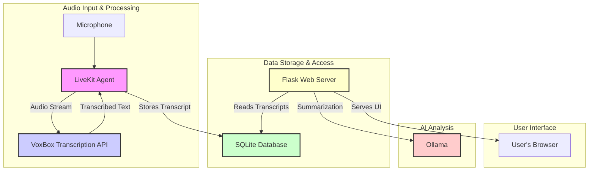

# Project: Long-Term Voice Recorder with AI Processing

This project is an open-source, modular system designed to continuously capture audio, transcribe it using a local speech-to-text engine, store the transcripts, and provide a web interface for browsing and future AI-driven analysis.

## System Architecture

The system comprises several key components that work together:



### 1. **LiveKit Agent (Audio Input + Transcript Management)**
-   **File:** `agent.py`
-   **Functionality:**
    -   Captures live audio from the environment using a LiveKit Agent.
    -   Utilizes Silero VAD for voice activity detection.
    -   Streams audio to the local VoxBox service for transcription.
    -   Receives transcribed text from VoxBox.
    -   Saves finalized transcripts to the SQLite database.
    -   Manages session information in the database to keep transcripts separate.

### 2. **VoxBox (Local Transcription API)**
-   **Directory:** `vox-box/`
-   **Functionality:**
    -   A separate Python service (installed via `pip install vox-box`).
    -   Hosts a local instance of the `Systran/faster-whisper-small` model (via Hugging Face).
    -   Exposes an OpenAI-compatible API endpoint (typically `http://localhost:5002/v1`) that the LiveKit Agent sends audio to.
    -   Returns transcribed text to the agent.
    -   Requires its own virtual environment due to dependency conflicts.

### 3. **SQLite Database (Persistent Data Store)**
-   **Default File:** `voice_transcripts.db`
-   **Schema & ORM:** `app/database/models.py` (SQLAlchemy models: `User`, `Session`, `Transcript`)
-   **Functionality:**
    -   Stores all user information, recording sessions, and transcription results.
    -   Uses UUIDs as primary keys for all tables.
    -   Includes support for metadata such as confidence scores, timestamps, language, and custom JSON fields.
    -   Managed via SQLAlchemy ORM, with helper functions in `app/database/helpers.py` and `app/database/__init__.py`.

### 4. **Flask Web Server (UI & API)**
-   **File:** `app/web_app.py` (run via `run_webapp.py` or directly)
-   **Functionality:**
    -   Provides a web interface (HTML templates in `app/templates/`) to:
        -   Browse all saved recording sessions (`/`).
        -   View detailed transcripts for a specific session (`/session/<session_id>`).
        -   Copy/paste transcript text.
    -   Includes an analysis page (`/analyze/<session_id>`) that combines transcripts for a session and uses a local Ollama instance (via the `openai` library) to generate a summary of the text.
    -   Exposes an API endpoint (`/api/transcripts/<session_id>`) to fetch transcripts for a session in JSON format.

### 5. **Local LLM (Ollama Integration)**
-   **Service:** Uses a locally running Ollama instance.
-   **Connection:** The Flask Web Server connects to Ollama using the `openai` Python client.
    -   Default Ollama API Base URL: `http://localhost:11434/v1` (configurable via `OLLAMA_BASE_URL`).
    -   API Key: Required by the `openai` client, can be any string for local Ollama (configurable via `OLLAMA_API_KEY`, defaults to "ollama").
-   **Functionality:**
    -   Provides text summarization for transcripts on the `/analyze` page.
    -   Default Model: `gemma3:4b` (configurable via `OLLAMA_MODEL`).
    -   The system is designed to be extensible for other AI-driven insights in the future.

---

### 6. **Scripts & Management**
-   **`scripts/manage_db.py`:**
    -   A command-line utility for database operations:
        -   `create`: Initializes the database schema (uses `app/database/create_tables.py`).
        -   `reset`: Drops all existing tables and recreates the schema.
        -   `seed`: Populates the database with sample data for testing.
-   **`app/database/create_tables.py`:**
    -   Contains the core logic to create database tables based on SQLAlchemy models.
-   **Environment Configuration:**
    -   Uses a `.env` file (see `.env.example`) for settings like `DATABASE_URL`, `OLLAMA_BASE_URL`, `OLLAMA_API_KEY`, and `OLLAMA_MODEL`.

---

## Setup and Installation

### Prerequisites
-   Python 3.10+
-   SQLite (comes with Python)
-   Ollama installed and running (see [Ollama website](https://ollama.com/)). Ensure the desired model (e.g., `gemma3:4b`) is pulled: `ollama pull gemma3:4b`.
-   Separate virtual environments for the main application and VoxBox are recommended.

### 1. Main Application Setup
   ```bash
   # Clone the repository (if you haven't already)
   # git clone <repository-url>
   # cd <repository-directory>

   # Create and activate a virtual environment
   python3 -m venv .venv
   source .venv/bin/activate

   # Install dependencies (includes 'openai' for Ollama)
   pip install -r requirements.txt

   # Copy and configure environment variables
   cp .env.example .env
   # Edit .env to set DATABASE_URL (default is sqlite:///voice_transcripts.db)
   # and Ollama settings if needed:
   # OLLAMA_BASE_URL=http://localhost:11434/v1
   # OLLAMA_API_KEY=ollama
   # OLLAMA_MODEL=gemma3:4b

   # Create database tables
   python scripts/manage_db.py create

   # Optionally seed the database
   python scripts/manage_db.py seed
   ```

### 2. VoxBox (Transcription Service) Setup
   ```bash
   cd vox-box

   # Create and activate a separate virtual environment
   python3 -m venv venv
   source venv/bin/activate

   # Install VoxBox
   pip install -r requirements.txt # This installs the 'vox-box' package

   cd .. # Return to project root
   ```

## Running the Application

1.  **Start Ollama:**
    Ensure your Ollama service is running. If you installed Ollama as a desktop application, it might start automatically. Otherwise, you may need to start it via the command line:
    ```bash
    ollama serve
    ```
    Ensure the model you intend to use (e.g., `gemma3:4b`) is available: `ollama list`. If not, pull it: `ollama pull gemma3:4b`.
    Keep this service running.

2.  **Start VoxBox:**
    Open a new terminal, navigate to the `vox-box` directory, activate its virtual environment, and run:
    ```bash
    # In vox-box/ directory, with vox-box venv active
    vox-box start --huggingface-repo-id Systran/faster-whisper-small --data-dir ./cache/data-dir --host 0.0.0.0 --port 5002
    ```
    Keep this service running.

3.  **Start the LiveKit Agent:**
    In another terminal (at the project root, with the main application's venv active):
    ```bash
    python agent.py console
    ```

4.  **Start the Flask Web Server:**
    In yet another terminal (at the project root, with the main application's venv active):
    ```bash
    python run_webapp.py
    ```
    Or for development mode:
    ```bash
    flask --app app.web_app run --debug --port 5000
    ```
    Access the UI at `http://localhost:5000`.

---
### Notes & Key Directories
-   **`agent.py`**: Core logic for audio capture and initial transcript handling.
-   **`vox-box/`**: Contains setup for the local transcription server.
-   **`app/database/`**: SQLAlchemy models, database initialization, and helper functions.
-   **`app/web_app.py`**: Flask application, routes, and UI logic.
-   **`app/templates/`**: HTML templates for the web interface.
-   **`scripts/`**: Database management scripts.
